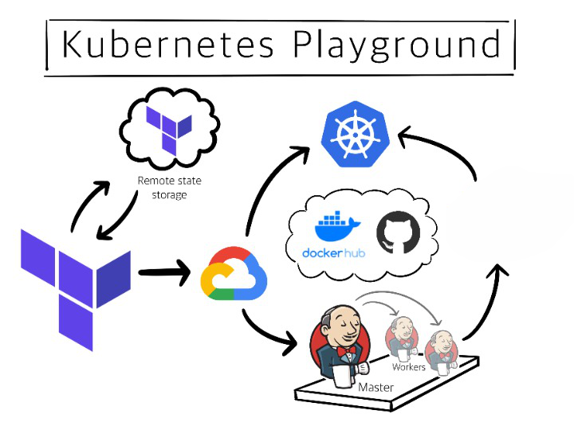

## Table of contents
* [General info](#general-info)
* [Technologies](#technologies)
* [Setup](#setup)

## General info
Building our infrastructure on GCP [ Google Cloud Platform ] using terraform : 
*  Network infrastructure [ VPC , Subnets , Firewalls , NAT , Router ]
*  Private GKE [ Google Kubernetes Engine ] 
*  Private Compute Engine To controll Private GKE

Deploy Jenkins Deployment [ master + slave ] :
* Using Pipeline job we going to deploy on our cluster

Configure Github : 
* Once the developer push , it will trigger jenkins pipeline and deploy on our GKE Cluster 

## Technologies
* Terraform
* GCP [ Google Kubernetes Engine ] 
* Jenkins
* GitHub
* DockerHub

## Setup our infrastructure
$ cd Terraform_GCP
$ terraform init
$ gcloud auth application-default login
$ terrform apply

  
## Deploy jenkins on our cluster
* SSH into our Private VM 
* Install [ Gcloud , Kubectl , Activate ServieAccount to make VM Controll the Culster ] , it's all inside Script.sh
* Connect To our Cluster using gcloud container clusters get-credentials NAME [--internal-ip] [--region=REGION     | --zone=ZONE, -z ZONE] 
* kubectl apply -f Deployment

